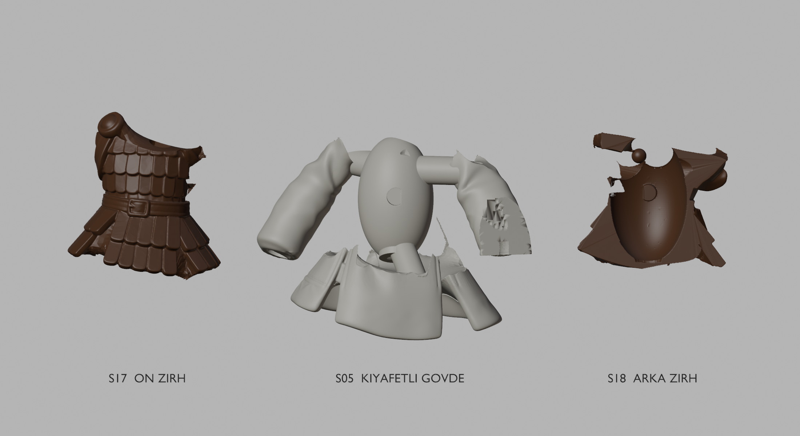
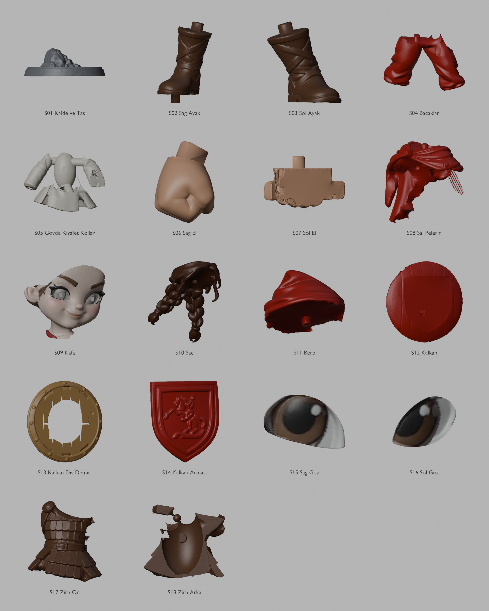
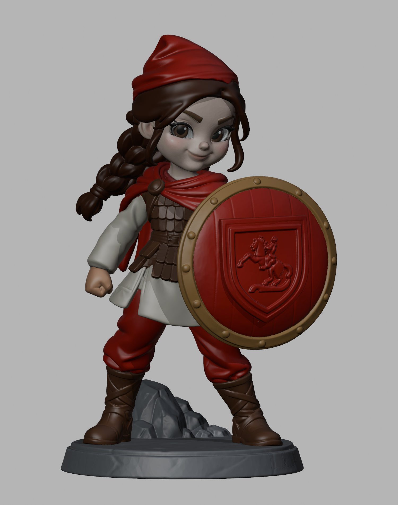

# Amazon Çocuk — 160 mm / 18 ana parça

Kaide dahil **160 mm**, reçineli baskı için sadeleştirilmiş **18 STL**. **Ön ve arka zırh gövdeden ayrıdır**; boyandıktan sonra kıyafetli gövdeye takılır. Düzeltilmiş yüz korunmuştur, iki göz ayrı takılabilir.

## Tam modeli indir

**[18 parçalı tam ZIP (1.25 GB)](https://github.com/mtarikucar/amazon-cocuk-160mm/releases/download/v2.0.0/Amazon_Cocuk_160mm_18_Parca_Tam_Set.zip)** · [v2.0.0 release](https://github.com/mtarikucar/amazon-cocuk-160mm/releases/tag/v2.0.0)

ZIP: 18 STL, Blender, montaj 3MF, geçme kuponu, önizlemeler ve belgeler. GitHub'ın “Source code” arşivi model dosyalarını içermez; yukarıdaki tam ZIP kullanılmalıdır.

153 parça yerine 18 ana parça: 200 figür için **3.600 ana parça**. Bere/kol desenleri decal için düzleştirildi; küçük renk alanları ayrı STL değildir. Saç, bere, kafa, iki göz, şal-pelerin, kıyafetli gövde, iki el, kalkan, metal çerçeve, arma, bacaklar, iki bot, kaide ve iki zırh kabuğu ayrıdır.

- [Montaj ve boyama kılavuzu](docs/v2/ONCE_OKU_Montaj_ve_Uretim.md)
- [18 parça ve ölçüleri](docs/v2/Parca_Listesi.md)
- [Kontrol özeti](docs/v2/Son_Kontrol_Ozeti.json)
- [ZIP içeriği ve SHA-256](delivery-manifest-v2.json)
- [Önceki 153 parçalı sürüm](https://github.com/mtarikucar/amazon-cocuk-160mm/releases/tag/v1.0.0)

STL birimi mm. Fiziksel baskı testi yapılmadı; seri üretimden önce geçme kuponu ve tam numune basılmalıdır. Decal baskı sayfası pakete dahil değildir.

