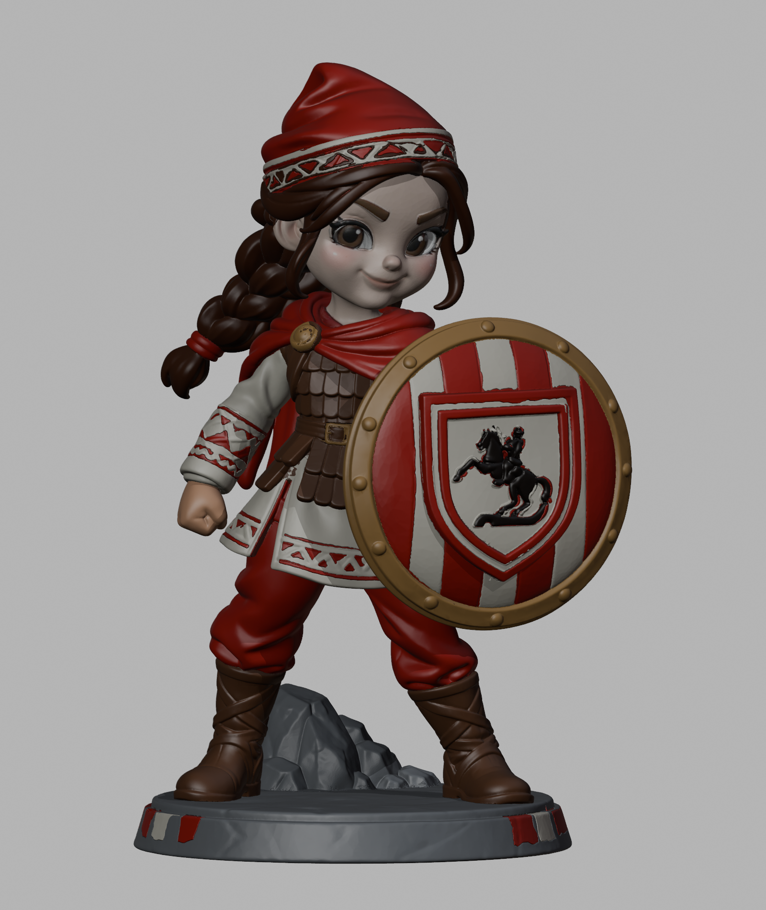
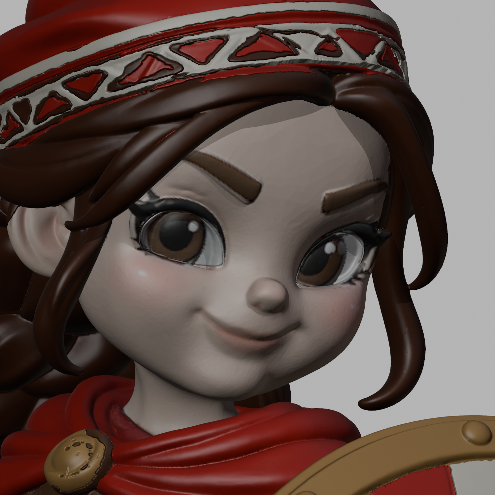
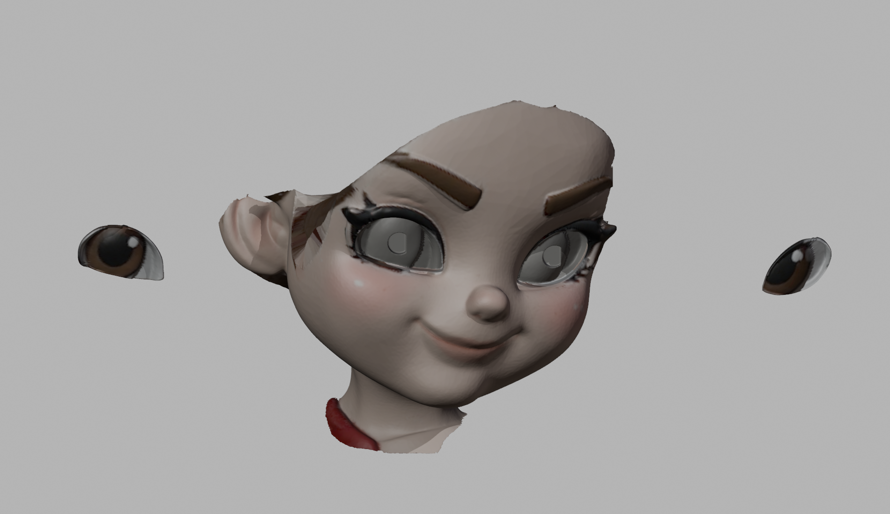

# Amazon Çocuk — 160 mm parçalı model

Kaide dahil **160 mm**, reçineli baskı için hazırlanmış **153 parçalı** model. Kaş, kirpik ve dudak yüzle bütünleşiktir; sağ ve sol göz ayrı boyanıp takılabilen iki parçadır.

## Tüm dosyaları indir

**[Tam model ZIP'i — 1,38 GB](https://github.com/mtarikucar/amazon-cocuk-160mm/releases/download/v1.0.0/Amazon_Cocuk_160mm_Yuz_Duzeltilmis_Tum_Parcalar.zip)** · [Release sayfası](https://github.com/mtarikucar/amazon-cocuk-160mm/releases/tag/v1.0.0)

ZIP; 153 STL, düzenlenebilir Blender dosyası, birleşik 3MF, geçme test kuponu, önizlemeler ve montaj belgelerini içerir. Büyük model dosyaları release eki olarak tutulur. GitHub'ın otomatik “Source code” ZIP'i yalnızca bu reponun belgelerini ve önizlemelerini içerir; model için yukarıdaki tam ZIP bağlantısını kullanın.

- [Montaj ve üretim kılavuzu](docs/ONCE_OKU_Montaj_ve_Uretim.md)
- [Parça listesi — 200 set için miktarlar](docs/Parca_Listesi.md)
- [Son geometri kontrolü](docs/Son_Kontrol_Ozeti.json)
- [ZIP içeriği ve SHA-256](delivery-manifest.json)

STL birimi **mm**. Dosyalar desteklenmiş baskı tablaları değildir. Fiziksel baskı testi yapılmadı; 200 adet üretimden önce geçme kuponu ve bir tam numune basılmalıdır.

## Önizlemeler

